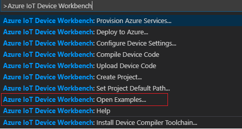

# Azure IoT Central example for esp32-azure-kit
In this tutorial, you will learn how to use the esp32-azure-kit board to send data to Azure IoT Central and to receive events back from Azure IoT Central to be processed by the board.

## Features implemented
- Telemetry data sent for all onboard sensors
- LED status of network, Azure IoT send events
- Display temperature and humidity on screen
- Reported twin property dice number is sent when shaking the device (uses accelerometer sensor data)
- Cloud to device messages (supports sending a message to display on the screen, press button to go back humiture screen)
- Desired twin property to turn on a fan at a defined speed and temperature (Need to connect a L298N DC motor control)
- Direct twin method calls to turn on and off a fan (Need to connect a L298N DC motor control)

## What you need
- An esp32-azure-board kit

    

- An active Azure subscription. If you do not have one, you can register via one of these two methods:
  - Activate a [free 30-day trial Microsoft Azure account](https://azure.microsoft.com/free/).
  - Claim your [Azure credit](https://azure.microsoft.com/pricing/member-offers/msdn-benefits-details/) if you are MSDN or Visual Studio subscriber.

## Open the project folder
### Start VS Code

- Start Visual Studio Code.
- Make sure [Azure IoT Workbench](https://marketplace.visualstudio.com/items?itemName=vsciot-vscode.vscode-iot-workbench) is installed.
- Connect ESP32-azure-kit to your PC.

### Open IoT Workbench Examples

- Use `F1` or `Ctrl+Shift+P` (macOS: `Cmd+Shift+P`) to open the command palette, type **IoT Workbench**, and then select **IoT Workbench: Examples**.

    

- Select **ESP32 Arduino**.

    

- Then the **IoT Workbench Example** window is shown up.

    

- Find **ESP32 IoT Contral Sample** and click **Open Sample** button. A new VS Code window with a project folder in it opens.

    

## Create Azure IoT Central application

1. Use you Azure account log into [Azure IoT Central](https://apps.azureiotcentral.com).
2. Create a **free custom applicaton**.

    

3. Click **Create Device Templates** and enter a template name to create a new template
4. Click the **Edit Template** button, then click the **New measurement** button to add measurements

    

5. Create new **Telemetry** as below:

    | Display Name  | Field Name    | Unit  | Minimum Value | Maximum Value |
    | ------------- |:------------- |:-----:|:-------------:|:-------------:|
    | Temperature   | Temperature   |   ℃  |     -40       |       100     |
    | Humidity      | Humidity      |   ℃  |       0       |       100     |
    | Light         | AmbientLight  |   lx  |       0       |       3800    |
    | Pressure      | Pressure      |  kPa  |      26       |       126     |
    | Altitude      | Altitude      |   M   |               |               |
    | MagnetometerX | MagnetometerX | mgauss|               |               |
    | MagnetometerY | MagnetometerY | mgauss|               |               |
    | MagnetometerZ | MagnetometerZ | mgauss|               |               |
    | Pitch         | Pitch         |   °   |     -180      |       180     |
    | Roll          | Roll          |   °   |     -180      |       180     |

    >Note: You can only add the measurements that you care about, you don't need to add all of them 

6. Click **Device Explorer** -> **+** -> **Real** to add a real device. After creating the device, it will navigate to the device template page. 

    

7. Click the **Properties** tab, then click **Edit Tempalte**. Select **Number** on the Liabray at the left of the page, then add the following properties

    | Display Name  | Field Name    |
    | ------------- |:-------------:|
    | Dice Number   | dieNumber     |

8. Click the **Commands** tab, then click **Edit Tempalte**. Click **New Command** at the left of the page, then add the following properties

    | Display Name  | Field Name    | Data Type     |
    | ------------- |:-------------:|:-------------:|
    |   Message     |   echo        |    text       |

9. Click the **Settings** tab, then click **Edit Tempalte**. Select **Number** on the Liabray at the left of th page, then add the following properties

    | Display Name  | Field Name    | Unit  | Minimum Value | Maximum Value | Initial Value |
    | ------------- |:------------- |:-----:|:-------------:|:-------------:|:-------------:|
    | Fan Speed     | fanSpeed      |   %   |     10        |       100     |       50      |

    Click **Save** and repeat this step to add the follwing properties

    |       Display Name    | Field Name    | Unit  | Minimum Value | Maximum Value | Initial Value |
    | --------------------- |:------------- |:-----:|:-------------:|:-------------:|:-------------:|
    | Temperature Threshold | temThreshold  |  ℃   |      -40      |       100     |       30      |

    Click the  **Commands** tab again, then click **Edit Tempalte**. Click **New Command** at the left of the page, then add the following properties

    | Display Name  | Field Name    | Data Type     |
    | ------------- |:-------------:|:-------------:|
    |   Start Fan   |   startFan    |    text       |
    |   Stop Fan    |   stopFan     |    text       |

    >Note: This step requries a L298N DC motor control connect to the GPIO 12 and 13 on the esp32-azure-kit board, if you don't have the motor connected, you can skip this step

10. At last, click **Connect** button at the top right of the page, it will pop  **Device Conenction** page. Download the dps-keygen tool at [here](https://github.com/Azure/dps-keygen/tree/master/bin) based on your OS, use the dps_cstr tool to generate the connectoin string as below.

    

    ```
    dps_cstr <scope_id> <device_id> <Primary Key(for device)> 
    ```
    **scope_id**, **device_id** and **Primary Key** is listed on the **Device Connectin** page.

## Config Device Code

1. Open the source file(.ino) for device code and update the following lines with your WiFi ssid and password:
    ```csharp
	// Please input the SSID and password of WiFi
	const char* ssid     = "";
	const char* password = "";
    ```

2. Copy and paste the device connection string that generated on the previous step into the following line in device code.
	
   This copies the connection string that is retrieved from the `Create Azure IoT Central application` step.

    ```csharp
	/*String containing Hostname, Device Id & Device Key in the format:                         */
	/*  "HostName=<host_name>;DeviceId=<device_id>;SharedAccessKey=<device_key>"                */
	/*  "HostName=<host_name>;DeviceId=<device_id>;SharedAccessSignature=<device_sas_token>"    */
	static const char* connectionString = "";
    ```

## Build and upload the device code

1. Open the command palette and select **IoT Workbench: Device**, then select **Device Upload**.

	

2. VS Code then starts verifying and uploading the code to your DevKit.

	

3. The ESP32 device reboots and starts running the code.

    >Note: M5Stack-Core-ESP32 is set as the default board after the IoT project is created. To change the setting, use `F1` or `Ctrl+Shift+P` (macOS: `Cmd+Shift+P`) to open the command palette, type and select **Arduino: Board Config**. Change to use **ESP32 Wrover Module (esp32)** board in the **Arduino Board Configuration** window.

    

## Monitor device status in Azure IoT Central
1. Use you Azure account log into [Azure IoT Central](https://apps.azureiotcentral.com)

2. Once the device is connected to WIFI, the WIFI LED will be turned on. Once the device connect and send data to Azure IoT Central, the Azure LED will blink while sending data. The device's defalut screen will show the temperature and humidity.
    
    

3. Navigate to the device **measurements** page, you'll see all the telemetry data from the device

    

4. Navigate to the device **Commands** page, write a message at the **Message** grid and click **Run**, the message will display on the dvice screen. 

    
    >Note: Click the **KEY_IO0** button on the device will switch the messaage screen to humiture screen

5. Shake the device, it will simulate shaking a dice and report a random dice number to IoT central, you can see the dice number at the IoT Central **Properties** page
    
    

6. This step requries a L298N DC motor control connect to the GPIO 12 and 13 on the esp32-azure-kit board. Once you have the motor control connect with a fan and the board, navigate to the **Commands** page, you can use the **Start Fan** and **Stop Fan** command to control the motor on and off.

    

    Navigate to the **settings** page, you can set the fan speed and temperature threshold, once the temperature is greate than the defined value, the fan will start automaticlly at the speed.

    